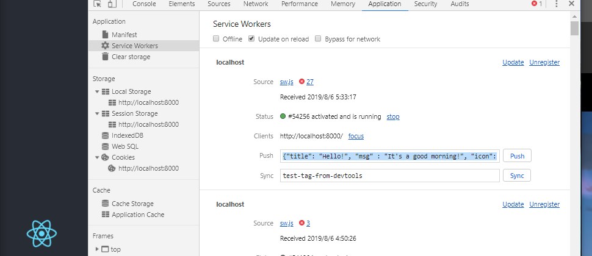

# How to build this app?

# setup project
```shell
npx create-react-app push-notification --typescript
cd create-react-app
npm install
npm run start # check this app's soundness
sudo npm install -g web-push
npm install react-app-rewired
web-push generate-vapid-keys --json| jq . > vapid-key.json
echo "vapid-key.json" > .gitignore
echo -n "export const applicationServerPublicKey = " > src/publicKey.ts
cat vapid-key.json | jq ".publicKey" >> src/publicKey.ts
```
 
# edit `src/serviceWorker.ts`

- first, import `applicationServerPublicKey`
```typescript:src/serviceWorker.ts
import { applicationServerPublicKey } from './publicKey'
```
- second, implement a helper function base64 -> uint8array

see. `urlB64ToUint8Array` at `src/utils.tsx`

- third, edit `registerValidSW`

see. `src/serviceWorker.ts`

- 4th write your serviceworker

see. `public/sw.js`

- 5th add `src/config-overrides.js` for overwrite this react-app's configuration

see. `src/config-overrides.js`

see `package.json` (this change is for reflect an above code.)

- 6th enable serviceWorker

```typescript:src/index.tsx
// serviceWorker.unregister();
serviceWorker.register();
```

# How to run it?
```shell
npm run start
```

Open `localhost:8000` in your browser, then you can get notification.

And also, You can try **Push** from your chrome browser!

1. F12 to open a developers' window
2. select `Application` and also select `ServiceWorker`
3. check `Update on reload` to easy our emulation.
3. please input some json like below.
```json
{"title": "Hello!", "msg" : "It's a good morning!", "icon": "/favicon.ico"}
```



4. you can get another notification!
